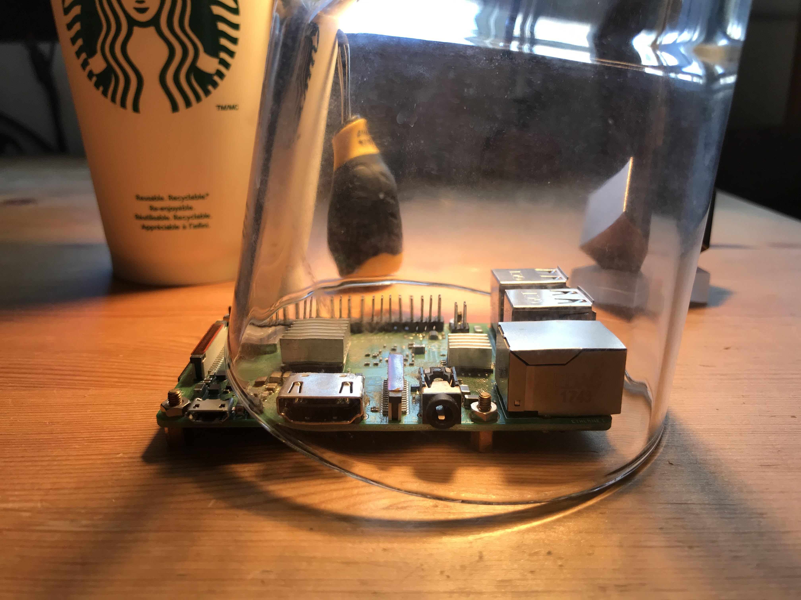
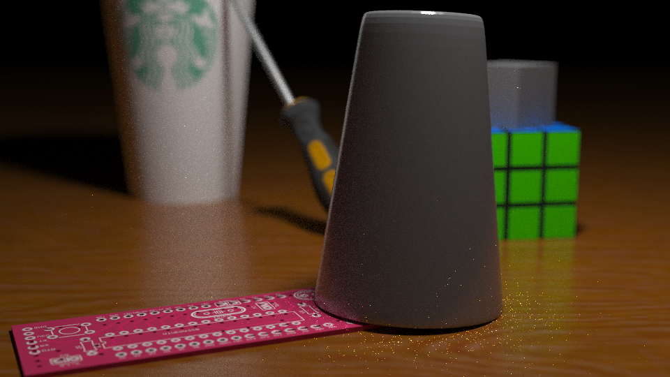

Ray tracing and to a greater extent, its sister algorithm, path tracing, have always 
fascinated me, beginning back in my high school days. At its core, the idea of ray
tracing is remarkably elegant: simulate the bounces of light in a scene and capture
those photons that manage to make it to a camera. This is unlike rasterization,
which, although fast, is inelegant and not physically accurate.

In fact, here was one of the very first images I rendered back then with a
simple recursive ray tracer:

I am very fortunate to be a student in Professor [Ravi Ramamoorthi](http://cseweb.ucsd.edu/~ravir/)'s 
[CSE 168](http://cseweb.ucsd.edu/~viscomp/classes/cse168/sp20/168.html) class at UCSD, where we get to learn about physically-based
rendering methods as well as other modern path tracing algorithms. Over
the duration of this course, we've begin incrementally building up a modern
path tracer, starting with a path tracer handling only direct light and
adding indirect lighting, next event estimation, Russian Roulette, 
physically-based GGX BRDFs, and multiple importance sampling features.
The path tracer also runs using Nvidia's OptiX 6.5 framework,
which allowed me to take advantage of my laptop's GTX 1050 to gain
a significant speed improvement.

For my final project in this class, I will be extending the path
tracer with the following algorithms:
* Depth of Field Effects
* Texture Mapping
* Glass Microfacet BTDFs
* Smoke via Volumetric Path Tracing

Additionally, I have crafted my own scene to best showcase these
new features. Please see below for a description of this process.

Do note that this is still a work in progress (hence the part I).
The glass BTDF and volumetric path tracing are currently incomplete.

#### Creating a Reference Image

My first step was to create a reference image. I wanted to use objects
in my scene that I actually have interacted with on a daily basis
to make it more personal. It was also convenient for me to use these 
objects since they were readily available in my room.

I have specific reasons for using and positioning these objects
like so. You can read more in my [proposal](http://dmhacker.github.io/cse168/proposal.pdf).

#### Crafting a 3D Scene using Blender

The next step was to recreate this scene using a 3D computer 
graphics modeling suite. I choose to use Blender, since it
works reasonably well on Linux, is free, and comes with 
many handy features, such as imports/exports to and from
a variety of different formats, path tracing and rasterizer
previews, and the ability to attach realistic materials to 
objects in the scene (including specifying their BRDFs).

Before this experience, I had never actually worked with
any 3D rendering software, much less an advanced tool like
Blender, so it took me a while before I felt comfortable
using it. Blender's learning curve reminds me of that of
Vim: it's difficult to navigate around at first when you
don't know any of the keybindings and tools, but as you
learn more and more, you eventually reach a critical point
at which it suddenly seems much easier.

In addition to learning Blender, I also spent several 
hours actually making my scene. There were two challenging
parts to this:

1. Finding the models and textures to use. I scoured
a bunch of free sites, such as Sketchpad and Clara, 
searching for the right, free models. Ideally, I would
search for .obj/.mtl or .fbx file formats, since they
come with good textures and Blender seems to like them.
I should note that I was even unable to find a suitable
model for the Raspberry Pi in my original image, so I
swapped it out with a microcontroller breadboard.

2. Scaling and positioning all of the models. Importing
them is half the battle. In addition to all of the models,
I also set up where my camera and light should be.

At the end, I found myself with a pretty nice scene. I
rendered a preview using Blender's Cycles engine, which
provided me with a benchmark from which I could gauge
progress on my own path tracer.

Do note that I didn't enable any smoke or depth effects
when using Cycles, so this image isn't completely accurate.
I also swapped out the wood textures and made the tungsten
cube less reflective, so this image is slightly outdated.
It's still a good preview nonetheless.

#### Importing the Scene into my Path Tracer

At this point, my scene was basically complete. However,
I needed some way to transfer the scene out of Blender
and into my own path tracer, since my original path tracer 
was only configured to read specially formatted CSE 168
.test files.

There were several options to choose from:

* .dae "Collada" format: This format was appealing for
many reasons. It's human readable, it includes camera
and lighting data, it has support for "extra" data that
can be appended to each object, and it's Blender's first
choice for exports. However, I ended up not using it because
Blender kept distorting the rubber handle on my screwdriver,
so when I re-imported it, the mesh looked completely wrong.
* .fbx format: This format is probably the smallest out of
my options because it's not human readable. It's also proprietary.
Those two issues dissuaded me from using it.
* **.obj/.mtl "Wavefront Object/Material" format**: This is
the choice I ended up settling on. 

The Wavefront object file format is extremely well-known, and 
there exist many C++ libraries such as [BLY-7's OBJ-Loader](https://github.com/Bly7/OBJ-Loader)
that can handle it very well. The object file format has
support for texture and shading data. Texture coordinates
are kept inside vertices, and links to the texture files 
are kept inside the material file. 

There were two main problems with the Wavefront object file 
format unfortunately. I had to work around these:

* No camera or lighting data saved. Object file formats describe
objects, not scenes. My workaround was to store this data in a
separate .test CSE 168 file. This scene file then referenced my
object file to load the objects in the scene. The camera,
lighting, and other parameters were kept inside the overarching
scene file. I manually copied all of the positions of the camera and
the light from my scene; one annoyance with this approach was that
Blender keeps its positions in Y-up format (the Y-axis is the up
direction) where my path tracer was using Z-up format. In the object
file, Blender will automatically convert its Y-up system to a
Z-up system, so thankfully, that was all taken care of. 
But, unfortunately, that conversion had to take place manually for
my camera and light; it took me a bit to figure all of that out.
* Object files only support primitive Blinn-Phong shading parameters,
which are non-PB. However, my scene in Blender was using physically-based 
"principled" microfacet BRDFs in all internal material data. Blender's
solution to this is to encode all of this PBR information into the Blinn-Phong
parameters. For example, when Blender exports its BRDF "roughness" parameter,
it will turn this into a shininess value in the range of [0, 900] by
subtracting the roughness value from 1, multiplying it by 30, and the squaring
it. My solution to this problem was just to adapt Blender's import source code
appropriately in my own path tracer.

##### Rendering the Outline

To make sure everything was working, I first disabled all of my shading and 
recursive path tracing. Instead, whenever I hit an object, I would just
return the object's diffuse color immediately. This allowed me to continually
tweak my camera's parameters until I felt satisfied that I had replicated
the original scene in Blender to a reasonable extent.

This left me with the following scene.

It's not very pretty, but you can see the outlines of all of the different
objects, which is exactly what I needed.

##### Applying Shading

The next step is to add back shading. This served two purposes.

1. I could gauge the position of my light in the scene using the shading
of the objects as reference.

2. I could better tweak my interpretation specular, diffuse, and roughness 
parameters until I was satisfied that they looked natural.

After some fiddling, I managed to get this scene.

Perfect. The materials with no textures, such as the tungsten cube and
Rubik's cube, looked very realistic without much adjustment, owing to
the microfacet BRDF implemented previously. For more context on what
this BRDF is, please see [this paper](http://www.graphics.cornell.edu/~bjw/microfacetbsdf.pdf).
The microfacet distribution used is GGX. BRDF importance sampling,
next event estimation, and multiple importance sampling were all 
enabled. 64 samples per pixel were taken. These contants remain
the same for all subsequent images.

#### The Depth of Field Effect

My next step was tackling depth of field. My current path tracer was
assuming that a "pinhole" camera model is in use. This means that
the camera is treated as a fixed point in space; all camera rays
start at the camera's origin position.

Obviously, this is not physically accurate. In real life, cameras have a
lens through which light is captured. Not all light is directed
to a single point in the camera. This is what results in depth of field,
wherein a camera is able to focus on an object and make the rest of the
scene blurry. There are two parameters that control this depth of field
effect:

1. Focal distance. The focal distance of a camera specifies how far out
it focuses. For a real camera, this is usually given in terms of millimeters.
2. Aperture size. The aperture size controls the blurriness of the objects
not in focus. For a real camera, the aperture is usually specified in
an inverted fashion, such that a small aperture usually means an out-of-focus 
background. A wide aperture, conversely, would indicate that the background
is more in-focus.

This effect can be simulated in my path tracer by making a modification
to how my camera is set up. I added two additional parameters to describe
my camera, focal distance and aperture size. Then, I modified my camera ray
generation algorithm as such:

1. Calculate the camera's origin and outgoing ray direction as one would
in a pinhole camera.
2. Generate a focal point by computing origin + direction * focal length.
3. Generate any perpindicular vector to the outgoing ray direction 
and normalize it. I did this by taking the cross product of my camera's
up vector and the ray direction and then normalizing the result. This
vector I call "offset vector 1".
4. Generate a third perpindicular vector by taking the cross product
of offset vector 1 and the outgoing ray direction. I call this vector
"offset vector 2".
5. Now, generate a random float between [-0.5, 0.5] and multiply it
by the aperture size. Then, scale "offset vector 1" by this random
float.
6. Do the same for "offset vector 2".
7. Add both offset vector 1 and offset vector 2 to the camera origin.
This is the new origin of the outgoing ray.
8. Finally, generate a new outgoing direction by subtracting the focal
point from the new origin and normalizing the subtraction.

This algorithm effectively simulates an aperture. The ray's origins are
perturbed such that they could be anywhere in the aperture circle
that is perpindicular to the direction the camera is facing. If the aperture 
size is set to a very large number, then the simulated aperture will be
very large and you will get rays that start at a completely different
distance from the origin of the camera. If the aperture is small, the
camera ray's origins will be very close to the original camera position. If the
aperture is 0, then you effectively have a pinhole camera again.

I set my camera to focus on the glass cup and use a big-enough aperture size
to produce visibly distinct blurring.

#### Texture Mapping

#### What's Next?

