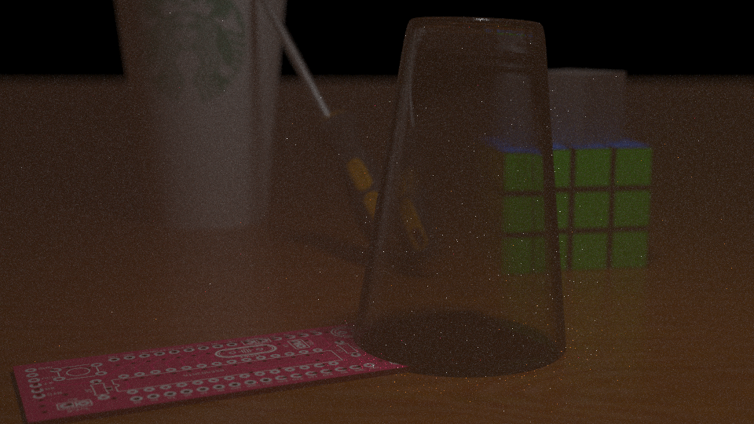

For starters, please first read my previous post, [part 1](/blog/2020-05-26-path-tracing-part-i/), which
describes some of the context regarding the construction of
my path tracer. I left off last time with an incomplete 
glass renderer, so this is where the blog post picks up from.

#### Rendering Glass

I began by trying to implement a glass BTDF based off of
microfacet theory, as specified in my previous post. This led
to the failing render:

After about a day and a half of tweaking variables to try to get it
to work, I figured I would have to take a different approach. 
From what I could tell, the formulas for the PDF and evaluation functions 
I was implementing seemed correct, and the refractive directions I was 
sampling appeared to behave correctly depending on the mediums they
were entering/exiting, so I wasn't sure exactly what was going on.
I decided to try a different approach.

Using Bram de Greve's [paper on refractive ray tracing](https://graphics.stanford.edu/courses/cs148-10-summer/docs/2006--degreve--reflection_refraction.pdf), 
I tried to use a simpler approach. My teaching assistant, Andrew Bauer, 
suggested that I assume that the surface was ideally dielectric and
work from there. This meant that I would:

* Assume that any refracted rays were ideally coming from a single,
perfectly refractive direction. Imperfect glass (e.g. glass with roughness) 
perturbs the refracted rays slightly, but that was not my focus.
* If a refracted ray originates from a single direction, then this would
imply that my sampling procedure returns that ray with probability 1 and
other rays with probability 0. I choose then to ignore my PDF by setting
it to 1 and then cancel out the BTDF cosine term using my evaluation function.

Despite this, I still needed to handle an important phenomenon when it
comes to rendering refractive materials: total internal reflection (TIR).
The basic idea behind total internal reflection is that if an incoming
ray hits a material at a sufficiently grazing angle, the resulting outgoing ray
will not actually be refractive, but rather, will be parallel to the surface
and thus reflective. The angle at which this phenomenon occurs is known
as **the critical angle** and is a property of the indices of refraction
for both the incoming and outgoing mediums. For more information, please
see the above paper or [the Wikipedia entry on TIR](https://en.wikipedia.org/wiki/Total_internal_reflection).

Fortunately, this phenomenon can be modeled fairly compactly in a path
tracer by making use the [Fresnel coefficient](https://en.wikipedia.org/wiki/Fresnel_equations#Complex_amplitude_reflection_and_transmission_coefficients), 
which in turn, can be generated using [Schlick's approximation](https://en.wikipedia.org/wiki/Schlick%27s_approximation).
The Fresnel coefficient essentially yields a number between 0 and 1
that lets us select between reflection and refraction. A high Fresnel
coefficient indicates a high amount of reflection; conversely, a low
Fresnel coefficient indices a high amount of refraction. A Fresnel
coefficient of 1 indicates total internal reflection (e.g. there is no
refraction, only reflection). In path tracing, we can importance sample 
the Fresnel coefficient to select between a refractive and reflective incident ray.
The algorithm works as follows:

1. Keep track of incoming and outgoing indices of refraction. We can do
this by keeping track of the mediums the rays are in.
2. Calculate the dot product of the surface normal and the outgoing ray.
3. Use the cosine value and the IORs to calculate the Fresnel coefficient.
4. Importance sample the Fresnel coefficient to select between reflection
and refraction.

In my case, I only had to keep track of two indices of refraction, the
first being that of glass and the second being that of air. I choose to
use 1.51 for Flint glass and 1.003 for air. In my previous attempts, I
extended my payload to keep track of the order in which these indices
appear, as it is important in determining the correct refractive ray.

I also swapped out my glass cup for a glass sphere, since it is
easier to render and debug. The inside of the sphere is not hollow,
but rather is assumed to be entirely filled with glass.

By rendering the intensity of the Fresnel coefficient as a shade
of red on top of the diffuse version of the sphere, I got the
following image. Note that I only accounted for Fresnel coefficients
for rays originating from the camera:

As we can see, the Fresnel coefficient is extremely high around the
edges of the sphere but is very low near the center of the sphere,
where the rays hit perpindicular to the surface and are simply
refracted through.

The next step is to implement the generation of the refractive
ray. This can be done using the refraction formula listed in the
above paper. With a few tweaks, I ended up with the following image:

Looks pretty good! You can see how the sphere acts as a lens,
effectively inverting the rays passing through it. This is why
the image appears upside down; this actually models real-world
physical phenomena. See [this discussion](https://www.quora.com/Why-crystal-clear-glass-spheres-turnn-the-image-upside-down) for more details.

The final step is to bring back the more complex glass cup 
to replace the sphere.

Ultimately, I was very satisfied with the glass rendering that I
produced. I decided to leave it as an ideal dielectric surface
and not tweak it any further using the GGX BTDF, since additional
attempts to incorporate the BTDF ended in failure. Unfortunately,
it took me around three days to finally get this to work, which
ate into the time I had allotted for rendering participating 
media using volumetric path tracing.

You'll also notice that the area covered by the glass seems 
shadowed, and that is in part because next event estimation does 
not work through glass (direct light through glass does not
account for refracted rays; it's treated as if it is a solid
object during the estimation).

#### Rendering Participating Media

For the final step of my project, I choose to render some form
of a homogeneous participating medium that will surround most of
the scene. Unfortunately, due to the unforeseen amount of time that the
glass implementation took, I was unable to complete it in a visually
appealing manner. However, I will still document the implementation
details, even though it did not contribute to my final render. The
following resources were helpful in my implementation: the
[smallvpt](https://github.com/seifeddinedridi/smallvpt) renderer, a modification
of the smallpt renderer to support volumetric path tracing, as well
as [this Stack Exchange post](https://computergraphics.stackexchange.com/questions/227/how-are-volumetric-effects-handled-in-raytracing) on volumetric path tracing.

In order to implement a partipicating medium, you need to use
volumetric path tracing. Volumetric path tracing extends the
rendering equation with additional terms that describe how a
ray moves through a semi-transculent container of particles.
For this project, I assumed that the particles were homogeneous,
in that they were evenly dispersed through the volume.

Whenever a light ray passes through this volume, there are 3 situations
that can occur:

* Nothing happens, the ray passes through as normal.
* The ray hits one of the particles and is absorbed.
* The ray hits one of the particles and is scattered.

These frequency of these events occurring are given by two probabilities:
the scattering probability and the absorption probability. The
scattering probability is a function of both the distance the ray
must travel through in the medium and a constant dependent on the
medium, known as $sigma_s$. Likewise, the absorption probability
is a function of the distance the ray must travel and a constant that
acts as a property of the medium ($sigma_a$). Both of these probabilities
are given as exponential functions that converge to 1 with respect to
distance; that is, as the ray travels through the medium, a longer 
distance implies a smaller chance that the ray will make it through
unscathed (not reflected or absorbed).

In the case where the ray is absorbed, the ray can simply be stopped
and contribute a reduced amount of radiance.

In the case where the ray is scattered, a new direction and origin has 
to be computed for the incident, scattered ray. The origin of this
ray is usually given by picking a random "scatter point" that lies in
between the first surface that the original ray intersects with and
the original origin. The direction of the new ray is a bit more complicated.
This is where phase functions come into play, which describe how rays
are scattered in the participating medium. I choose to use the
[Henyey-Greenstein phase function](http://www.astro.umd.edu/~jph/HG_note.pdf) to describe my medium.

Using this algorithm, I was able to produce the following image:

As you can see, the scattering of the rays is producing noticeable
darkening, as well as visible blurring that complements the
depth-of-field effect. This is an intended effect, as fog/smoke
often results in the same. However, the image was too noisy and
even with tweaking, still did not capture the realistic fog
effect I was intending to recreate, and without enough time to
modify it any further, I decided to drop the effect from my final
image. Despite this, I would still like to potentially work on this 
as an improvement to my image in the future.

#### Final Remarks

Given that the participating media render didn't look as
realistic as I would have liked it to look, I ultimately decided
to drop the fog/smoke effect from the final render. Here is the
final scene rendered, with depth-of-field added back in and
with 1024 samples per pixel (instead of the usual 64):

Ultimately, this was a very enjoyable project and, in my opinion,
was a successful end to a very enjoyable class. I hope to work
more with rendering in the future, perhaps continuing with
a real-time path tracer outside of the CSE 168 class.
