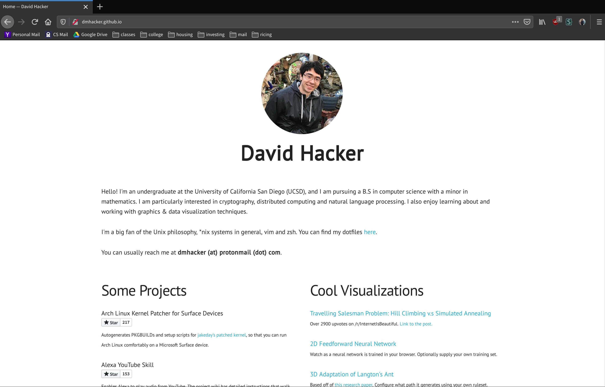
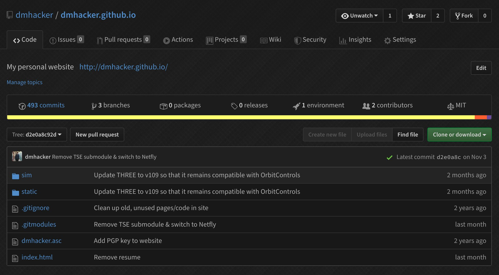
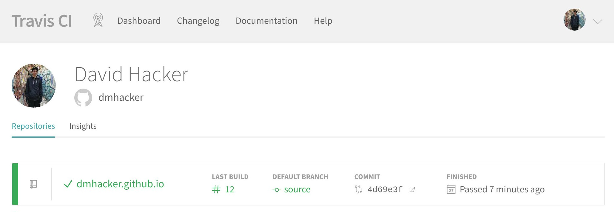
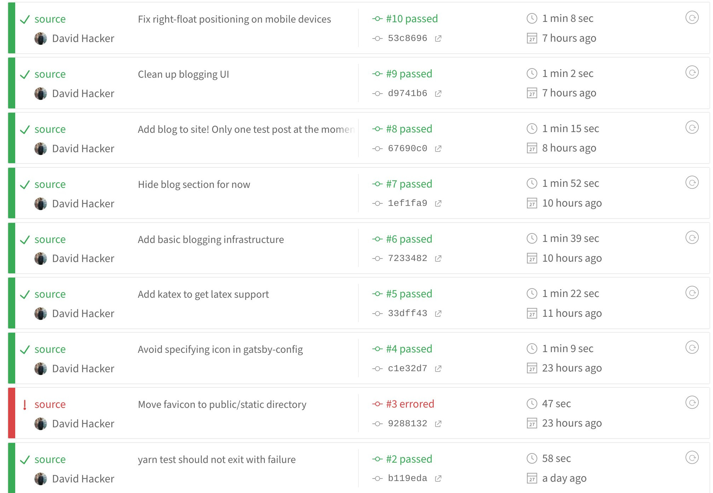

It's been a goal of mine to attach a blog to my personal website for a long time,
and I'm happy to say that I finally got around to the task. In order to better 
incorporate the new blogging interface, my website underwent some pretty significant 
internal changes, which I will discuss in my first ever post here!

#### Motivations

My motivations for creating a blog are actually pretty straightforward.

1. I think I have a lot to blog about, but I lacked a medium for it. I love learning
new things, and I would love to share insights that I've made with others who might
be interested in them. In addition, I wanted a (public) space where I could catalog
tidbits of information that I've picked up over the years, so that that knowledge
wouldn't go to waste when I inevitably forget about it.
2. I've always admired other technical content creators and their respective blogs. 
Some that come to mind are those of [Jeff Atwood](https://blog.codinghorror.com/), 
[Tristan Hume](https://thume.ca/), and [David Walsh](https://davidwalsh.name/). 
Even companies these days are starting to maintain their own technical blogs: 
[Bloomberg](https://www.techatbloomberg.com/blog/) (where I worked as an intern), 
[Google](https://www.blog.google/technology/), [Two Sigma](https://www.twosigma.com/insights/), 
[Jane Street](https://blog.janestreet.com/), to name a few.
When designing my blog, I drew inspiration from many of these existing sites.
3. It was the perfect time to do so. As part of my general education requirements
at UCSD, I am required to take a class called [CAT 125](https://sixth.ucsd.edu/cat/courses/cat-125/index.html),
focusing on improving my public rhetoric skills. The goals of the class and this blog 
lined up perfectly, so this will serve as an extremely useful, long-lasting final
project. Through immediate development of my blog, I am essentially killing two birds 
with one stone.

#### Design Approach

In the past, one of the main things holding me back was the fact that I would
have to develop a lot of infrastructure if I wanted to blog effectively on my
website. When I designed the current iteration of my website two or so years
ago, I did not design it assuming that I would, in the future, want to be able
to connect a blog to it.

Well, actually, let me be more specific. I did design the interface to be as
extensible as possible, and with regards to the UI, my website did not actually
have to change that much to accomodate the blog. However, the internals (my
codebase) had to change dramatically to support the dynamic functionality
that blogging requires.

Ultimately, however, the main constraint that my website faces is my reliance on 
GitHub Pages to host it. GitHub Pages cannot run web servers, which means that it
cannot use dynamic content; it only serves static HTML files from the repository 
root directory. I realize that the website, even as static HTML and JS files, could 
be configured to load content in dynamically through API calls to some backend 
(or database like Firebase), but I wanted to keep everything entirely self-contained
within GitHub Pages, such that I had no dependencies on external services. The tool
that I eventually choose allowed me to develop within these two criteria.

##### Before the Blog

I intentionally designed my website to be as minimal as possible, both structurally
and visually. This means both minimizing the amount of content on the page, 
minimizing the number of pages, and minimizing the amount of vibrant colors used.
There are several advantages to this design philosophy: (1) you get faster page load
times for free, (2) the muted, uniform color palette is easier on the eyes, and (3)
vibrant colors can be used to highlight important information or otherwise point
out critical sections to the user. Even with the blog now live, I like to think that 
I've still stayed true to these minimalist ideals.

This is what the home page used to look like. That's all the website really was.



Because of the website just had to support a single page with some assets, the
codebase was extremely small. In fact, it was almost entirely raw HTML with a
scattering of CSS and JS. The two important files:

* index.html
* static/css/site.css

The rest of the files were used for supporting old but working visualizations I 
designed using three.js.



##### Infrastructure Overhaul

While it's possible to develop a blog using solely HTML (every blog post like 
this one would basically get its own HTML file), this is both cumbersome and
error-prone. The main disadvantages:

1. Every blog post follows a consistent 'external' template, maybe containing
features like a header, footer, and navbar. The only thing differing between
blog posts is the content of the post itself. If I ever wanted to change the
outer template, I would have to go through each blog post and update them
manually. 

2. HTML is tough to write long blogs in. The XML tags and extreme nesting 
structure makes it hard to edit and easy to slip up. A much more natural
choice to develop blogs in is something like Markdown, which can be converted
to HTML but abstracts away all of the tags. In fact, the post you are reading 
right now was [actually written in Markdown](https://github.com/dmhacker/dmhacker.github.io/blob/source/content/blog/blog-12-04-2019-starting-a-blog/index.md).

The next step then was to replace the barebones HTML infrastructure with 
something that could support blogging, namely a <b>static site generator</b>.
I won't really go over the nuances behind static site generators, but if you're
interested in learning more about them, David Welsh wrote 
[a good blog post](https://davidwalsh.name/introduction-static-site-generators)
describing their features, use case scenarios, advantages, and disadvantages.

I choose to use a static site generator called [Gatsby](https://www.gatsbyjs.org/). Gatsby allows people
to write websites using their version of [React](https://reactjs.org/) and then compiles the JSX
you write into static HTML files. This flexibility is perfect for a blog,
because it allows you to write posts in your scripting language of choice
(like Markdown) and then, during compilation, convert the Markdown into
an HTML AST dynamically, which can then be loaded into a JSX template. I've
worked a fair amount with React in the past and was familiar with JSX so it 
made Gatsby an easy choice for the static site generator. 

The one-to-one correspondence between JSX and HTML is pretty simple to spot.
In fact, well-formed HTML is essentially JSX in its simplest form. This
made the translation from my old website smooth at first: all I had to
do was transplant the body from my index.html file into an index page
component within Gatsby. The metadata in the head of the HTML I moved
to a [React Helmet](https://github.com/nfl/react-helmet) component. 
Additionally, I was able to use the properties of JSX to shorten some of my 
repetitive home page code, specifically with respect to my projects and 
visualizations sections.

Converting this stuff from HTML to JSX was rather tedious, and one of the
reasons I put off this project for so long, but I am relieved that the
transition went by rather painlessly in the end.

##### Continuous Compilation 

At this point, I've now written the JSX code that can be compiled down to
HTML by Gatsby. But, now, how do we get GitHub Pages to show the
compiled HTML and not the source code? Recall that GitHub Pages is basically
a static web server that just maps the files in the repository directly to
website routes. It doesn't perform any compilation, code execution, or
database queries.

One solution is, after making a change to my Gatsby/JSX source code,
I manually re-compile the codebase on my machine and then upload
the results to a separate branch that GitHub Pages can serve. However,
this solution has the dreaded word 'manually' as a part of it. Engineers
should never strive to do tasks manually, especially when they are easily
automated. In this case, the manual part is re-compiling and then uploading
compiled HTML files. I want a way to automate that portion, such that that step
occurs automatically after I make a change.

Therefore, I enlisted the help of a continuous integration service that has
been integrated into GitHub. Normally, CI services are used for projects that
have unit tests to run, and whenever a change occurs in that project, the CI
service will automatically run the unit tests to make sure they still pass. 
In my case, I wanted the CI service to ignore tests and instead re-compile
my JSX source code and then push the results to a branch that GitHub Pages
recognizes.

To do this, I made use of [TravisCI](https://travis-ci.com/), which is one of the more popular CI
services. Other notable continuous integration services include [Jenkins](https://jenkins.io/)
and [CircleCI](https://circleci.com/), both of which I have also used in other projects. Travis
seemed like the most reasonable choice to me because they natively support
GitHub pages integration using simple configuration directives:

```
deploy:
  local-dir: public
  provider: pages
  skip-cleanup: true
  github-token: $GITHUB_TOKEN  
  on:
    branch: source
  target_branch: master
  keep_history: true
```

This tells Travis to monitor the `source` branch for commits and whenever
a commit is detected, re-compile and then push the build directory "public"
to the `master` branch. The interface looks something like this:



You can see that after every commit, the continuous integration server is
notified and triggers a rebuild. If the rebuild fails, it will mark the build
as failed and then notify me via email.



After setting up continuous integration, I now have a fully functioning website
again, looking exactly the same as what I started with. Whenever I make a change
to the `source` branch, the website will automatically update on GitHub Pages. 
It's finally time to add blogging functionality.

##### Blogging in Gatsby

It turns out that static site blogging using Gatsby is a pretty common paradigm (go figure).
It's so common that Gatsby provides almost perfect out-of-the-box support for it. With a
bit of tweaking, I was able to adapt this to work on my own site.

The key to all of this can be found in the [gatsby-starter-blog](https://github.com/gatsbyjs/gatsby-starter-blog) repository.
I suspected that the infrastructure in this starter blog was almost exactly what I
needed, and my hunch turned out to be correct. However, the starter blog meshes
this infrastructure with a lot of their own UI cruft, which I did not need. My task
thus become separating out the necessary blogging components from the UI components
and then incorporating the blogging components into my own website and rebuilding the UI.
This process was accomplished in the following manner.

1. Identify the files and code that would remain mostly unchanged when moved to my repository.
This was the "gatsby-node.js" file (responsible for turning Markdown blog posts into GraphQL nodes)
and then the GraphQL* queries themselves.

2. Add the MarkdownRemark Gatsby plugin to my "gatsby-config.js" file. This loads the MarkdownRemark
plugin and does the heavy lifting when it comes to converting Markdown posts to HTML abstract
syntax trees, which can then be loaded directly into my JSX components. The MarkdownRemark plugin
also had to be added via `yarn` to my Node dependencies list.

3. Create the "src/templates/blog-post.js" file. This is the external template for each blog
post mentioned earlier (contains things like a header and navigation bar). The template is
used to bring a blog post to life.

4. Create the "src/pages/blog.js" file. This is a centralized blog archive, a list of blog
posts arranged in descending order by time. It allows for viewers to browse past blog posts.
You can find [this page here](/blog).

5. Integrate a minified version of the above list into the "src/pages/index.js" file. In the
home page, I wanted a small list of the 3 most recent blog posts as a subsection underneath the
about section.

6. Create the folder "content/blog". This is where all my blog posts would go.

<sup>*As an aside, GraphQL is a flexible query language developed alongside React by Facebook that
Gatsby incorporated into their build system. You can store data as GraphQL 'nodes' and then
access those nodes by making queries inside JSX components. This allows for data to be
transmitted effectively throughout the website; the data can come from a wide variety of
sources, for example from directories or from a remote database.</sup>

With these steps completed, I had a working blog site. I then went about writing this post!

#### Future Plans

I am pretty satisfied with the current state of my website and blog.
The basics of a blog are all present: there's a centralized list of posts, people 
are able to view a condensed version of the list from the home page, and posts are 
tagged with a unique slug generated from their file names. Additionally, the interface
is consistent across both the blog and portfolio portions of my website, and everything
still remains both minimalist & modern.

There is always room for improvement however. In the future, I would like to look into:

1. Hooking an RSS feed up to my blog so news aggregators can track posts.
2. Adding comment sections so that anonymous users can provide feedback on blog posts.
Considering using [Remarkbox](https://www.remarkbox.com/) to do this.
3. Enabling keyword tagging in blog posts, similar to tags in YouTube videos.
4. Creating a search feature that searches posts by content, keywords, titles, etc.

Before tackling these updates, I hope to, foremost, continue writing blog posts in a
consistent fashion. My goal is write at least one post every week or at minimum, biweekly.
Since each post takes around 3-6 hours for me to write, this should be a reasonable 
amount of work.

Thanks for reading this (long) article. Until next time!
